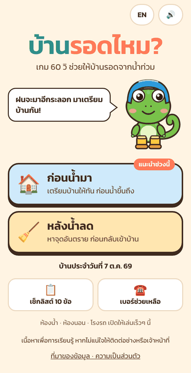
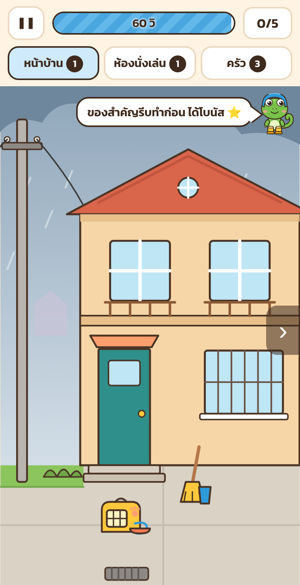
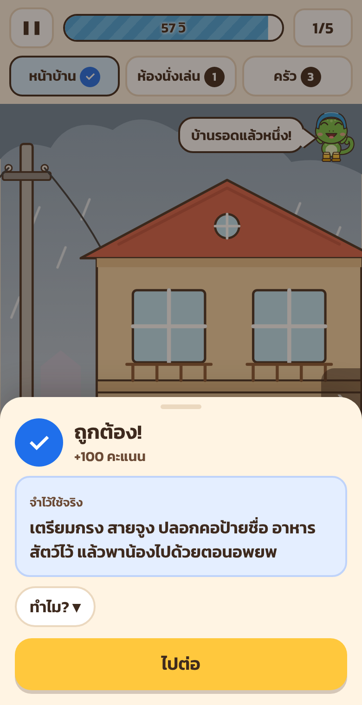

# บ้านรอดไหม? (Baan Rod Mai?)

**A 60-second hazard-hunt game that teaches Thai families how to protect their home from floods, and is built to be forwarded.**

- **ก่อนน้ำมา (Before the flood):** get the house ready before the water rises.
- **หลังน้ำลด (After the water drops):** spot the dangers before moving back in.

Every tap teaches one real action from a Thai agency (ปภ., กฟน., กฟภ., กรมควบคุมโรค, กรมอนามัย…). Every result becomes a card for the family LINE group.

<p>




</p>

> **Status (6 Oct 2026): v1.0.0 is ready to deploy but not yet live.**
>
> - The code is finished and every automated check passes: 12 rule tests and 24 headless-browser checks.
> - Before launch it still needs a domain, a forecast-app link, a review of 9 safety items flagged ⚠️, and a pass on real phones.
> - Start with **[HANDOFF.md](HANDOFF.md)**.

## Highlights

- **Plain HTML, CSS and JavaScript with SVG art.** No framework and no build dependencies. It runs on the **free Cloudflare Pages plan**.
- **Light:** 142 KB compressed to the start screen and 152 KB to the first game screen (the limit is 500 KB).
- **Plays offline after the first visit,** thanks to a service worker.
- **Works inside the LINE, Facebook and TikTok in-app browsers.** Where an app blocks sharing or downloads, the game falls back to another way.
- **All content is editable JSON** in `public/content/`. The build checks it before anything is published.
- **No personal data and no cookies.** Only anonymous event counts are collected.
- **Accessible:**
  - every tap target and button is at least 44 px on phones 360 px wide or wider
  - highlights are colour-blind safe (blue / orange / grey, plus shapes)
  - nothing flashes
  - it respects reduced-motion settings

## Quick start

```bash
node tools/build.mjs                    # validate content, generate preview pages and the service worker
npx wrangler@latest pages dev public    # http://localhost:8788
npm test                                # game-rule tests (no browser)
npm install && npm run smoke            # browser checks (needs Chromium; set CHROME_PATH if needed)
npm run check:docs                      # after editing docs: every relative link and anchor resolves
```

Node 18 or later is required. Cloudflare builds with Node 22, pinned in `.node-version`. Browser checks use `playwright-core` 1.63.0. Install its browser with `npx playwright@1.63.0 install chromium`, or point `CHROME_PATH` at any recent Chromium.

## Deploy (Cloudflare Pages, about 5 minutes)

Connect this repository under **Workers & Pages → Create → Pages → Connect to Git** and use these settings:

| Setting | Value |
|---|---|
| Framework preset | None |
| Root directory | *(leave empty: the repository root)* |
| Build command | `node tools/build.mjs` |
| Build output directory | `public` |
| Environment variable | `SITE_URL` = `https://<project>.pages.dev` or your own domain |

The full steps are in [docs/03-deploy.md](docs/03-deploy.md). They cover Wrangler direct upload, Web Analytics, the Analytics Engine binding, "Fail open", and baking your domain into the images.

## Documents

**Start here**

| Document | What's inside |
|---|---|
| [HANDOFF.md](HANDOFF.md) | Current state, what the owner must decide before launch, how to run and operate it, and next steps |
| [docs/ROADMAP.md](docs/ROADMAP.md) | What to do next: launch tasks and v1.1+ work as task cards with steps and "done when" |
| [AGENTS.md](AGENTS.md) | For AI assistants: read order, commands, definition of done, how the owner works, sandbox notes. Claude Code loads it through [CLAUDE.md](CLAUDE.md). |
| [CHANGELOG.md](CHANGELOG.md) | What changed, release by release |

**Project deliverables**

| # | Document | What's inside |
|---|---|---|
| 1 | [Safety content table](docs/01-safety-content.md) | 40 items, each with the wrong action, the correct action, a Thai tip (≤ 80 characters) and its official source. Anything not fully verified is flagged. |
| 2 | [Game design and wireframes](docs/02-game-design.md) | Rules, both modes, scoring, mascot, sharing, accessibility, the version 2 structure, and a code map |
| 3 | [Deploy to Cloudflare Pages](docs/03-deploy.md) | Git and Wrangler steps, the free-plan budget, and why link previews are pre-rendered |
| 4 | [Launch kit](docs/04-launch-kit.md) | Thai post copy (Facebook, LINE, TikTok), outreach, the Prepare → Return switch, and the seasonal relaunch |
| 5 | [Metrics plan](docs/05-metrics.md) | Event dictionary and Analytics Engine SQL for every metric |
| 6 | [Test checklist](docs/06-test-checklist.md) | Automated tests, plus a real-phone matrix covering 8 browser and app combinations |

**Reference for maintainers**

| Document | What's inside |
|---|---|
| [Knowledge base](docs/KNOWLEDGE.md) | Every rule, constant and formula; the content model; platform limits; audience research with sources |
| [Known issues](docs/KNOWN_ISSUES.md) | Open issues, platform limits and deliberate trade-offs, with measurements |
| [Guidelines](docs/GUIDELINES.md) | Rules for editing safety content, writing Thai copy, changing code, testing and releasing |
| [Approach and method](docs/APPROACH_AND_METHOD.md) | How the project was researched, designed, built and verified, and why |
| [Lessons learned](docs/LESSONS_LEARNED.md) | What went wrong or right while building it, and the rule each lesson became |

## แก้เนื้อหาเอง (สำหรับทีมที่ไม่ได้เขียนโค้ด)

ทุกอย่างที่ผู้เล่นเห็นอยู่ในโฟลเดอร์ `public/content/` แก้บน GitHub ได้เลย (กดรูปดินสอ → Commit) ระบบจะตรวจไฟล์ให้ก่อนขึ้นเว็บ ถ้ามีอะไรผิด เว็บเดิมจะยังอยู่ ไม่พัง

| อยากแก้อะไร | ไฟล์ | ระวัง |
|---|---|---|
| เปลี่ยนโหมดที่แนะนำ (ฝนกำลังมา / น้ำลดแล้ว) | `config.json` → `"rainWarningActive": true` หรือ `false` | |
| ลิงก์แอปเช็กระดับน้ำ / โดเมน | `config.json` → `forecastAppUrl`, `siteUrl` | ต้องขึ้นต้นด้วย `https://` |
| คำแนะนำ ตัวเลือก เคล็ดลับ คำอธิบาย "ทำไม?" | `items.json` | `tip` ไม่เกิน 80 ตัวอักษร · ต้องมีคำตอบถูก (`"correct": true`) ข้อเดียว |
| ที่มาของข้อมูล | `sources.json` | รหัสต้องตรงกับที่ใช้ใน `items.json` |
| ข้อความปุ่ม คำพูดน้องจก ฉายา ข้อความแชร์ | `strings.json` | อย่าลบ `{คำในวงเล็บปีกกา}` |
| เช็กลิสต์ 10 ข้อ | `checklists.json` | ต้องมี 10 ข้อพอดี · ถ้าแก้แล้ว รันภาพใหม่ด้วย `npm run images` |
| เบอร์ช่วยเหลือ | `helplines.json` | ตรวจเบอร์กับหน่วยงานก่อนทุกครั้ง |
| เปิดห้องใหม่ | `rooms.json` → `"enabled": true` | ต้องมีภาพห้องใน `public/art/rooms/` ก่อน |

ถ้าแก้คำแนะนำด้านความปลอดภัย ให้ใส่แหล่งที่มาใน `sources.json` ทุกครั้ง และโพสต์บอกผู้เล่นด้วยคำว่า **"UPDATE:"** อย่าแก้เงียบๆ (ดูกติกาเต็มใน [docs/GUIDELINES.md](docs/GUIDELINES.md))

## Project structure

```
public/            static site (Cloudflare Pages output directory)
  content/         ← editable JSON (items, rooms, strings, config, sources, checklists, helplines)
  js/              game modules (plain ES modules, no bundler)
  art/             room SVGs + sprite sheet
  fonts/           Kanit Thai/Latin subsets (SIL OFL, see fonts/OFL-Kanit.txt)
  og/ share/       pre-rendered link previews, checklists, sample cards
  c/ checklist/    generated link-preview pages
functions/api/e.js anonymous event counter → Workers Analytics Engine
tools/             build.mjs (validate + generate), render-images.mjs, sw.template.js, probe.mjs, check-docs.mjs
tests/             run.mjs (rules), smoke.mjs (headless browser)
docs/              everything above + screens/
AGENTS.md CLAUDE.md  guidance for AI assistants
```

## History

The game was first built on a feature branch of `bejranonda/carrier-vector-1988`, in its `baanrodmai/` folder. On 6 Oct 2026 it moved here, to the repository root, with its first two commits kept. That branch was never merged, and it has since been reset to `master`, so `carrier-vector-1988` holds only the flight sim again.

## Credits and license

- **Game, illustrations and the mascot น้องจก:** original work for this project. **License:** MIT, see [LICENSE](LICENSE).
- **Font:** [Kanit](https://github.com/cadsondemak/kanit) by Cadson Demak, SIL Open Font License 1.1 ([public/fonts/OFL-Kanit.txt](public/fonts/OFL-Kanit.txt)).
- **Safety guidance:** Thai government agencies, cited item by item in [docs/01-safety-content.md](docs/01-safety-content.md). The guidance itself belongs to those agencies; the game only links to and summarises it.

*เนื้อหาเพื่อการเรียนรู้ หากไม่แน่ใจให้ติดต่อช่างหรือเจ้าหน้าที่*
